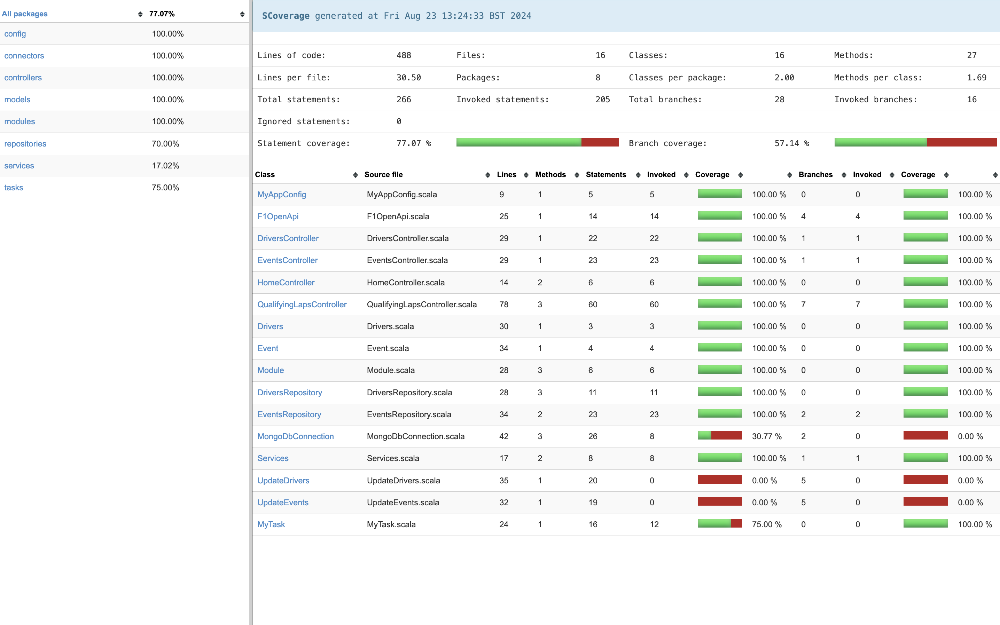

# F1 Insights API 

An API built utilising the Scala Play framework, Scala's Mongo DB driver, the Akka fork (Pekko), containerised using Docker and deployed on Google Cloud Platform. 

Hosted on Google Cloud Platform BaseUrl: ```https://myservice-m3p2yzv7ma-uc.a.run.app```

## Installation and Setup Instructions

Clone down this repository. You will need `Scala` and `sbt` installed globally on your machine.  

```sbt clean compile stage dist```

## Endpoints

```/``` : A request on this end point will return a basic response "Welcome to the f1 insights API". <br>

```/events``` : A request on this end point will return a list of qualifying events <br>

```/drivers``` : A request on this end point will return a list of driver name's/numbers <br>

```/quali``` : Using the above routes you can build a request on this end point, which will return a list of hotlaps 
when given a driver's race number and session key (Pulled from events route). 
If no query params are given it will return with an error response. A list of qualifying events can be accessed from 
the /events endpoint <br>

## Below is an example request: 
### Request 
`https://myservice-m3p2yzv7ma-uc.a.run.app/quali?driver_number=55&session_key=9570`

### Response

```JSON
[
  {
    "lap_number": 8,
    "sector_1": 32.279,
    "sector_2": 52.596,
    "sector_3": 30.294,
    "lap_time": "1m55.169"
  },
  {
    "lap_number": 11,
    "sector_1": 32.027,
    "sector_2": 52.266,
    "sector_3": 30.626,
    "lap_time": "1m54.919"
  },
  {
    "lap_number": 14,
    "sector_1": 32.057,
    "sector_2": 51.975,
    "sector_3": 30.606,
    "lap_time": "1m54.638"
  },
  {
    "lap_number": 16,
    "sector_1": 32.141,
    "sector_2": 51.513,
    "sector_3": 30.458,
    "lap_time": "1m54.112"
  },
  {
    "lap_number": 19,
    "sector_1": 32.129,
    "sector_2": 51.662,
    "sector_3": 30.696,
    "lap_time": "1m54.487"
  },
  {
    "lap_number": 22,
    "sector_1": 32.385,
    "sector_2": 51.619,
    "sector_3": 30.473,
    "lap_time": "1m54.477"
  }
]
```
**request template:** `https://myservice-m3p2yzv7ma-uc.a.run.app/quali?driver_number=[DriverNumber]&session_key=[SessionKey]`

## Testing 
To run tests use the following:  <br/> `sbt clean coverage test` <br/>
<br/> To view test coverage run the following commands: 
<br/> `sbt clean coverage test` 
<br/> `sbt coverageReport` <br/>




To view the report navigate to the Index.html file located inside the target directory form path: 
<br/> `/target/scala-2.13/scoverage-report/index.html`

## Docker: 
- set application secret <br>
  ```export SECRET="changeme"``` - Insert secret here <br> check is set with ```echo $SECRET```
- build image: <br>
```docker buildx build --platform linux/arm64 --build-arg SECRET=$SECRET -t [imageName] --load .```
- run container: <br>
```docker run --name [containerName] -d -p 9000:9000 -e PORT=9000 myimage```


## TODO list:
- update quali route to access data from mongodb collection and filter by building a query. 
- create new route to compare drivers fastest laps and times they were completed
- Working on dividing these laps into sessions q1 q2 q3 etc.. 
